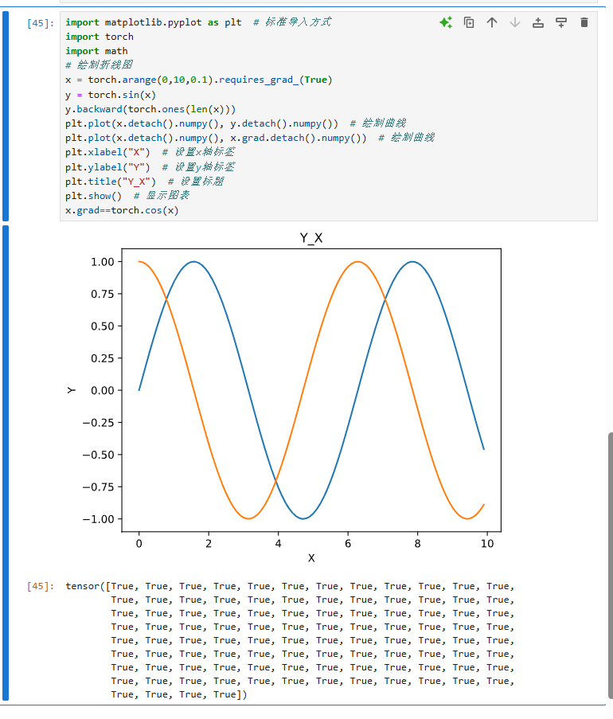

```

import matplotlib.pyplot as plt  # 标准导入方式
import torch
import math
%# 绘制折线图
x = torch.arange(0,10,0.1).requires_grad_(True)
y = torch.sin(x)
y.backward(torch.ones(len(x)))
plt.plot(x.detach().numpy(), y.detach().numpy())  # 绘制曲线
plt.plot(x.detach().numpy(), x.grad.detach().numpy())  # 绘制曲线
plt.xlabel("X")  # 设置x轴标签
plt.ylabel("Y")  # 设置y轴标签
plt.title("Y_X")  # 设置标题
plt.show()  # 显示图表
x.grad==torch.cos(x)
```
