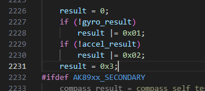

注意IIC引脚配置模式为高速开漏输出

苯人选了上拉模式


如果要加入DMP功能，记得MPU初始状态需要水平放置并保持静止才能通过自检，否则会报错（现象是重定向直接输出0或1或2（没有重定向的另说

但是如果在`inv_mpu.c`里加入这一句



```
result=0x3
```

相当于直接略过acc和gyr的自检环节，并且看起来没有副作用


使用函数：

```
main.c:
 /* USER CODE BEGIN 2 */
  MPU_Init();
  /* USER CODE END 2 */
  
   while (1)
  {     
      MPU_Data_Get();
     
      printf("Accel: X=%.2fg, Y=%.2fg, Z=%.2fg\n", imu_data.accel_x, imu_data.accel_y, imu_data.accel_z);
      printf("Gyro: X=%.2f°/s, Y=%.2f°/s, Z=%.2f°/s\n", imu_data.gyro_x, imu_data.gyro_y, imu_data.gyro_z);
      printf("Pitch: %.2f°, Roll: %.2f°, Yaw: %.2f°\n", imu_data.pitch, imu_data.roll, imu_data.yaw);
  
      HAL_Delay(100);

  }
```

