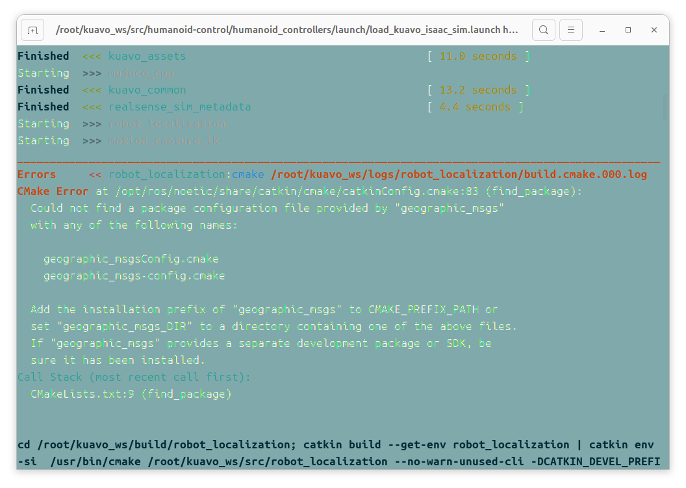
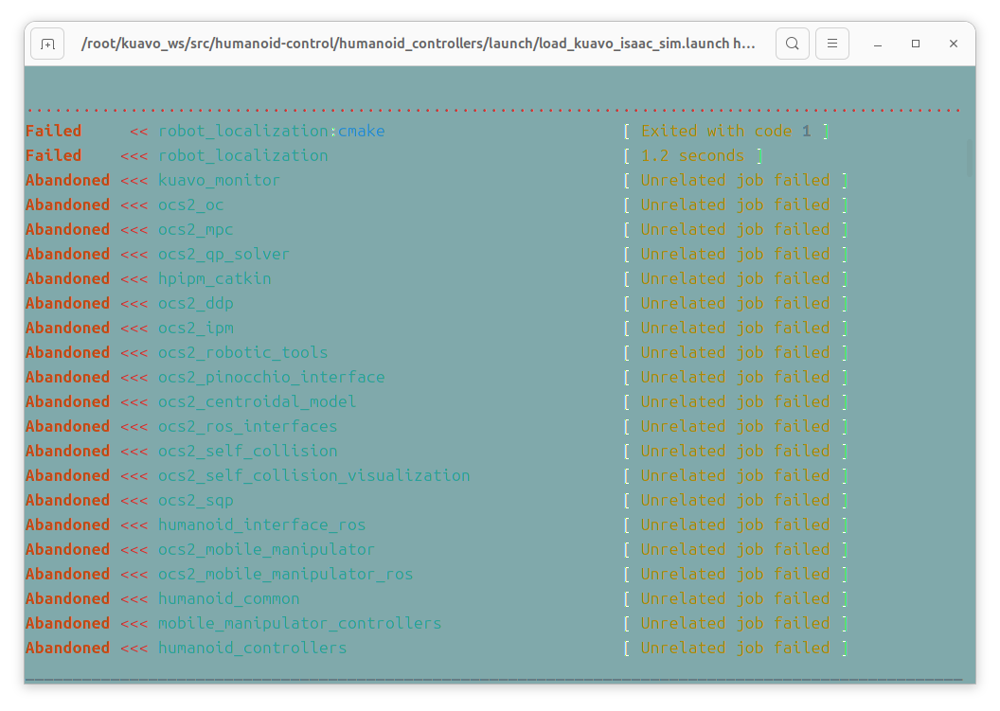
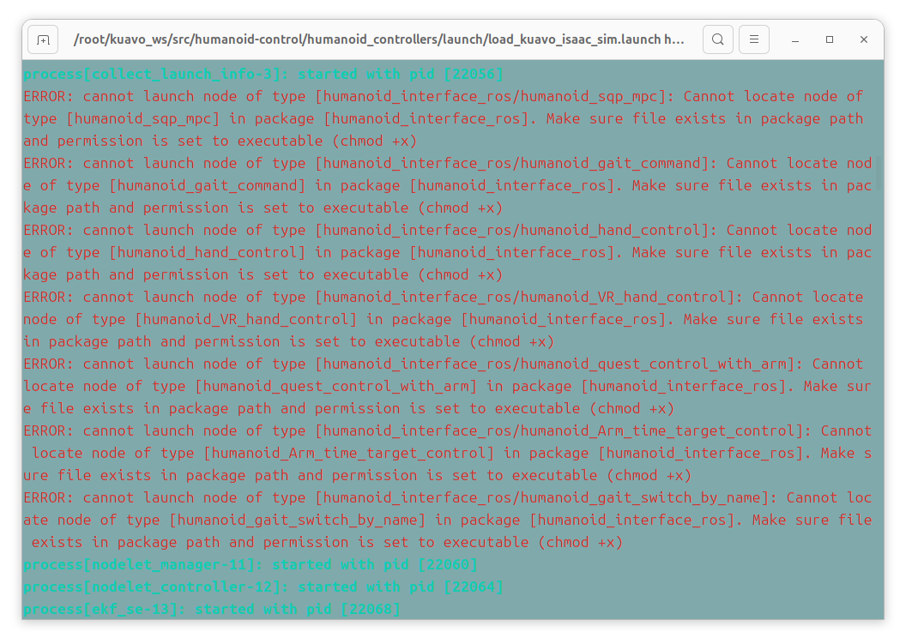
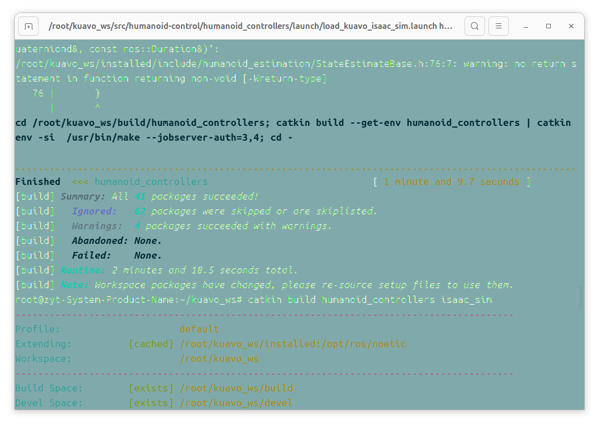
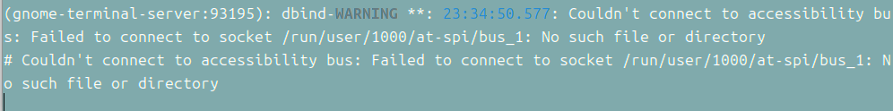
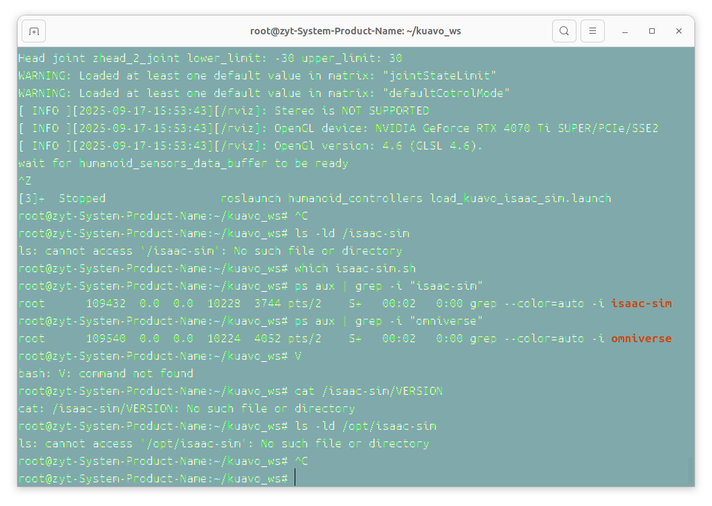

执行catkin build humanoid_controllers遇到：



这些藏在humanoid_control里的包都找不到，所以后面会闪退



原因是遗失了geographic包，解决方法:

```
sudo apt-get update  # 先更新 apt 软件源列表（可选，若长期未更新）
sudo apt-get install ros-noetic-geographic-msgs  # 安装 Noetic 版本的 geographic_msgs
# 检查 geographic_msgs 是否在 ROS 包路径中
rospack find geographic_msgs
```

如果下载不了尝试换源：

```
sudo sh -c 'echo "deb http://mirrors.aliyun.com/ros/ubuntu
```

下载完成：

```
root@zyt-System-Product-Name:~/kuavo_ws# rospack find geographic_msgs
/opt/ros/noetic/share/geographic_msgs
```

然后重新编译，就发现这个报错解决了




新问题：



```
export NO_AT_BRIDGE=1
```


卡在一句`wait for humanoid_sensors_data_buffer to be ready`就停住了，rviz和终端都出来了但是就是看不到issac sim，于是：



是容器里没有包含issacsim吗？？