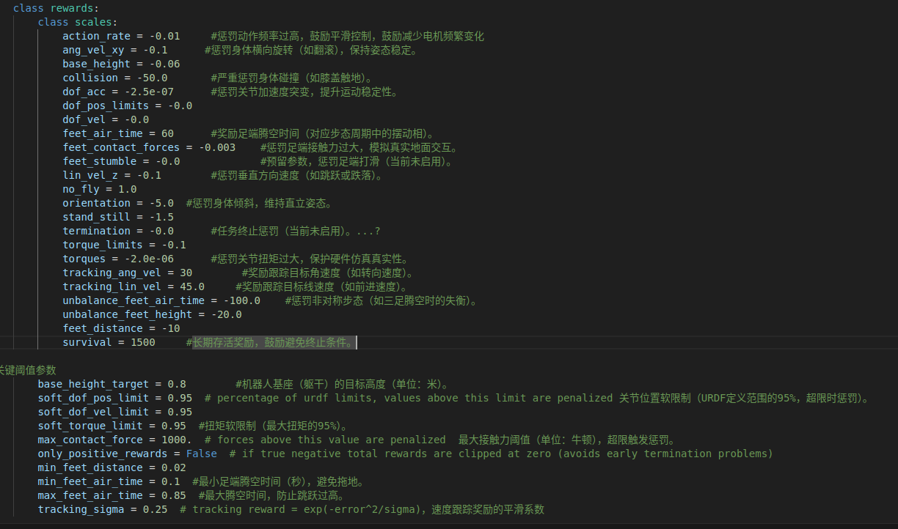

起码还是上升的yyyy虽然上升了一小会也卡住了


emmm怎么网站上的还不太一样  而且当坐标拉太长的时候变化不明显的会直接变成一条线


20.26先把base_height_target变成0.8逝一下

感觉0.8还是合理一点的


但是后面还是会掉下来（epochs=1000左右放缓，2000大跌


增大base_height防止瘫倒 `baseheight=-0.04`


在epochs=1500左右开始下跌

继续增大lin_val和ang_val（此时base_height=-0.04)

```
#23.02
tracking_ang_vel = 15        #奖励跟踪目标角速度（如转向速度）。
tracking_lin_vel = 30.0     #奖励跟踪目标线速度（如前进速度）。
```


总的来说可以看出来增大这三个参数是有用的

```
#7.5  00:38
tracking_ang_vel = 30        #奖励跟踪目标角速度（如转向速度）。
tracking_lin_vel = 45.0     #奖励跟踪目标线速度（如前进速度）。
```


```
#7.5 11:10   base_height->-0.06
```


```
#13.12
 base_height = -0.08
 tracking_ang_vel = 40        #奖励跟踪目标角速度（如转向速度）。
 tracking_lin_vel = 55.0     #奖励跟踪目标线速度（如前进速度）。
```


（绿色）emmm反而更早地掉下来了  


结合以下这些图可以发现  在`episode length`和`reward`出现反常下跌的同时，很多上面的子项都是由有规律地单调下降变成急速上升，猜测尽量让异常项都逐步下降可以实现目标效果？在表现最好的紫色这一版进行分析，，

……除了base_height和lin_vel_z特别诡异之外没有发现别的特别的  不好判断因果关系

先随便改一下试试看

退回到紫色那一版`（july5 11.10）`  然后修改以下参数

```
#7.5 17.15
ang_vel_xy = -0.1 
stand_still = -1.5
```



