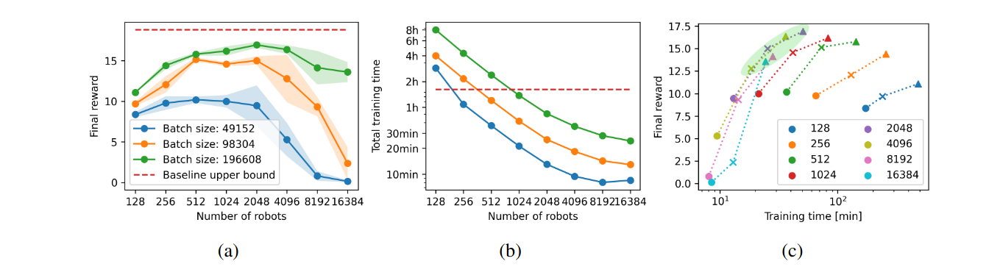
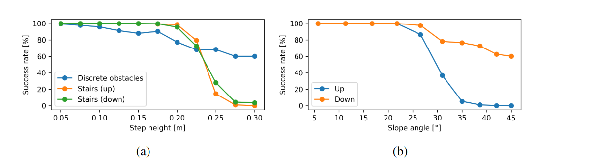
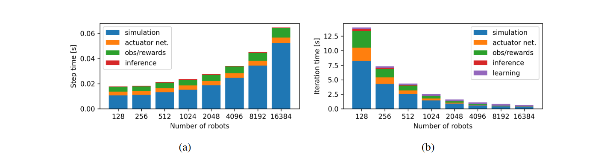
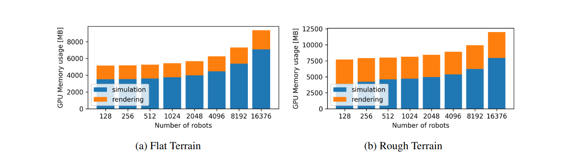
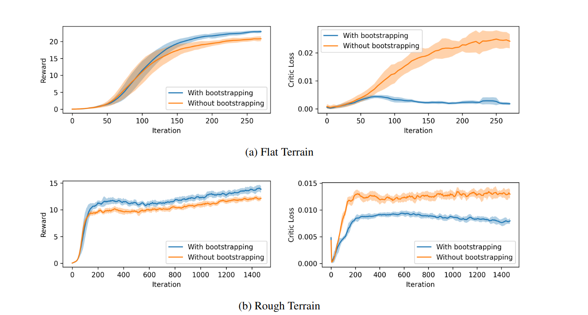
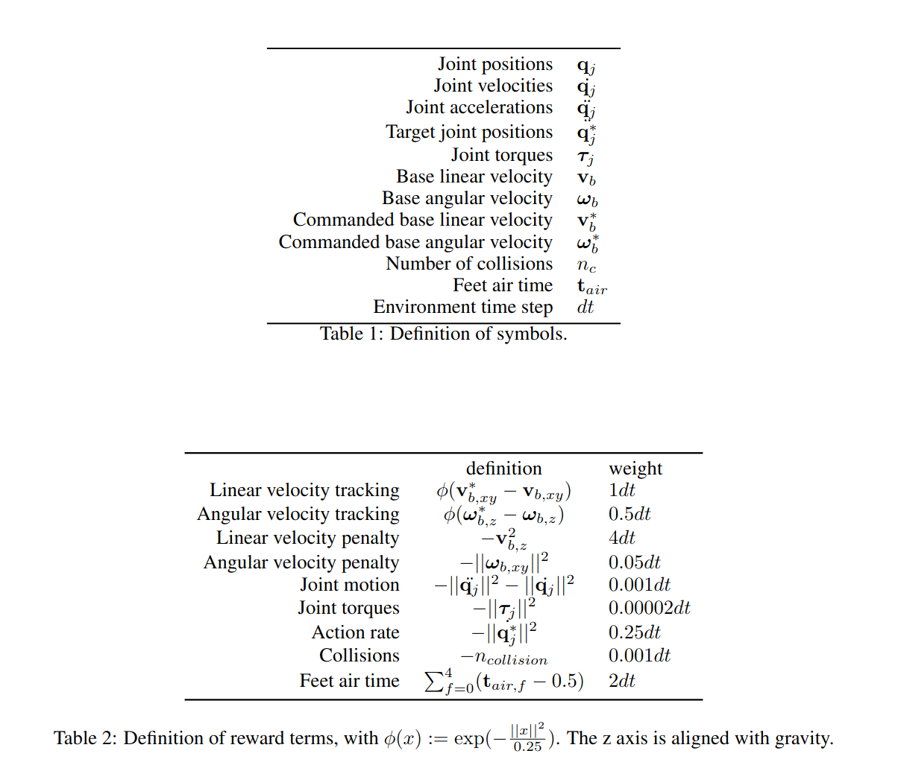
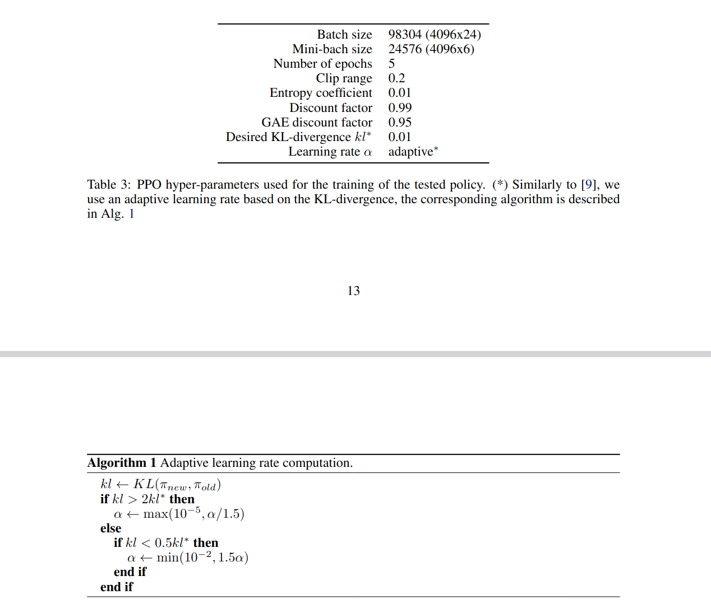

在诸如PPO（近端策略优化）这类同策略（on-policy）算法中，一个固定策略会先收集一定量的数据，然后进行下一次策略更新。这一批次大小（batch size）**B** 是学习成功的关键超参数：

- **数据过少**时，梯度噪声过大，算法无法有效学习；
- **数据过多**时，样本重复性高，算法无法从中提取更多信息，反而浪费仿真时间并拖慢整体训练速度。

批次大小的计算公式为 **B = n_robots × n_steps**，其中：

- **n_steps** 是每个机器人在每次策略更新中执行的步数；
- **n_robots** 是并行仿真的机器人数量。

由于我们通过大幅增加 **n_robots**（提升数个数量级）来加速训练，必须选择较小的 **n_steps** 以保持合理的 **B** 值，从而优化训练时间。然而，这种设置在同策略强化学习算法中尚未被充分探索。

### **关键发现**

1. **n_steps 的下限约束**
   - 理论上，单步数据也可用于学习，但实验表明，若 **n_steps** 低于某个阈值（如 **25 步**，对应仿真时间 **0.5 秒**），算法无法收敛至最优解。
   - 这是因为我们使用了 **广义优势估计（GAE）**，其有效性依赖于多步奖励信息。
2. **最大回合长度与重置机制**
   - 需区分 **n_steps** 和触发重置的**最大回合长度**（设为 **20 秒**）。
   - 环境仅在达到最大长度时重置，而非每次策略更新后重置，因此单个回合可能包含多次策略更新。
   - 这一机制限制了并行训练的机器人总数，导致无法充分利用 GPU 的全部算力。
3. **小批次（mini-batch）大小的优化**
   - 小批次大小是将批次数据拆分以执行反向传播的块大小。
   - 在超大规模并行场景中，我们发现：**远超常规实践的极大 mini-batch（数万样本）能稳定学习过程，且不增加总训练时间**。

### **总结**

- **平衡 n_robots 和 n_steps** 是优化训练效率的核心。
- **GAE 要求足够的连续步数**（≥25 步），过低的 n_steps 会破坏时序信息，导致学习失败。
- **超大 mini-batch** 在并行训练中表现优异，突破了传统实践的认知。

在训练过程中，机器人必须在跌倒时被重置，同时也需要定期重置以促使它们探索新的轨迹和地形。PPO（近端策略优化）算法中的**价值函数（critic）**用于预测未来无限时间范围内折扣奖励的总和。然而，环境重置会打破这一无限时间假设，若处理不当，可能导致价值函数性能下降。

### **重置类型及其影响**

1. **可预测的重置**（如跌倒或到达目标）
   - 价值函数能够预测这类事件，因此不会影响学习稳定性。
2. **超时重置（time-out）**
   - 由于未将**回合时间**纳入观测值，价值函数无法预知超时重置。
   - 若不特殊处理，超时重置会破坏价值函数对长期回报的估计，导致训练不稳定。

### **解决方案：超时重置的 Bootstrap 补偿**

- **区分终止模式**：明确区分失败重置（可预测）和超时重置（不可预测）。
- **奖励修正**：在超时重置时，用价值函数自身的预测值**（bootstrapping）**补偿未来折扣奖励的期望和。
  - 即：将价值函数的输出作为超时时刻的未来回报估计，并叠加到最终奖励中。
- **修改 Gym 接口**：
  - 标准 Gym 环境未区分超时与其他终止条件（如 Stable-Baselines 等流行实现均忽略此问题）。
  - 我们扩展了接口以检测超时，并实现上述补偿机制（详见补充材料中对奖励和价值函数损失的优化效果）。

### **实际训练中的必要性**

- 传统假设认为：**要么环境永不超时，要么超时仅发生在批次收集的最后一步**。
- 但在我们的场景中：
  - 每个批次的步数（`n_steps`）较少，而单回合（episode）可能覆盖多个批次。
  - 若忽略超时补偿，价值函数会因未完成的长期回报估计而产生偏差。

### **训练地形示例（图2）**

训练和测试中使用了多样化的仿真地形：

- **(a)** 随机粗糙地形（0.1米高度变化）
- **(b)** 25度倾斜斜坡
- **(c)** 阶梯（宽0.3米，高0.2米）
- **(d)** 随机离散障碍（高度±0.2米）

### **关键结论**

- **超时重置的 Bootstrap 补偿**是保证价值函数稳定性的必要措施，尤其在**短步长、多批次**的训练设置中。
- 现有强化学习框架（如 Gym）未原生支持此机制，需自行扩展实现。

（术语说明：`critic` 保留英文以明确指代价值函数，`bootstrapping` 译为“自举”或保留英文以契合强化学习领域惯例。）

所选择的地形具有现实环境的代表性。我们制作了五种程序性生成的地形，如图 2  所示：平坦地形、斜坡地形、随机粗糙地形、离散障碍物地形和楼梯地形。这些地形是边长为 8  米的方形拼接区域。机器人从地形的中心出发，会收到随机的航向和速度指令（在整个 episode  期间保持不变），促使它们在地形上行走。斜坡和楼梯以金字塔式结构布置，以便机器人能够向各个方向移动。

所有机器人都被分配了一种地形类型和一个代表该地形难度的等级。对于楼梯和随机障碍物，我们将台阶高度从 5 厘米逐渐增加到 20 厘米。斜坡地形的倾斜度从 0 度增加到 25  度。如果机器人成功走出其所在地形的边界，它的等级就会提升，下次重置时，它将在难度更高的地形上开始。然而，如果在一个 episode  结束时，它的移动距离不到目标速度所需距离的一半，它的等级就会再次降低。成功达到最高等级的机器人会被循环回随机选择的等级，以增加多样性并避免灾难性遗忘。这种方法的优势在于，能根据机器人的表现来调整训练难度，无需任何外部调整。它会针对每种地形类型单独调整难度等级，并为我们提供训练进度的视觉和定量反馈。当机器人达到最终等级，并且由于循环回退而均匀分布在所有地形上时，我们就可以得出结论：它们已经完全学会了完成这项任务。

<u>**3.2 观测、动作与奖励**</u>
<u>**策略接收机器人的本体感受测量数据以及机器人基座周围的地形信息。观测内容包括：基座线速度和角速度、重力向量测量值、关节位置和速度、策略选择的先前动作，以及从机器人基座周围网格中采样的 108 个地形测量值。每个测量值是地形表面到机器人基座高度的距离。**</u>

<u>**总奖励是九项的加权和，详细内容见补充材料。主要项鼓励机器人遵循指令速度，同时避免沿其他轴产生不期望的基座速度。为了产生更平滑、更自然的运动，我们还对关节扭矩、关节加速度、关节目标变化和碰撞进行惩罚。膝盖、小腿的接触，或脚与垂直表面的接触被视为碰撞，而基座的接触则被视为坠落，并会导致重置。最后，我们添加了一个额外的奖励项，鼓励机器人迈出更大的步伐，这会使动作在视觉上更具吸引力。我们为所有地形训练单一策略，并采用相同的奖励机制。**</u>

<u>**动作被解读为发送给电机的期望关节位置。在这里，PD 控制器会产生电机扭矩。与其他研究 [16,20] 不同，奖励函数和动作空间均不包含任何与步态相关的元素。**</u>

为了使训练出的策略能够更好地实现从仿真到现实的迁移，我们对地面摩擦力进行随机化处理，在观测数据中加入噪声，并在训练回合中随机推撞机器人，以教会它们保持更稳定的姿态。每个机器人的地面摩擦系数均从 [0.5，1.25] 区间内均匀采样得到。推撞动作每 10 秒发生一次，机器人基座在 x 轴和 y 轴方向上的加速度会被施加到 ±1  m/s。所加入的噪声量基于在真实机器人上测得的数据，详细信息见补充材料。

ANYmal 机器人采用了具有相当复杂动力学特性的串联弹性执行器，这些特性在仿真中很难准确建模。出于这个原因，并遵循先前研究的方法  [1]，我们使用神经网络根据关节位置指令来计算扭矩。不过，我们对模型的输入进行了简化。不同于以往将固定时间步长的历史测量数据拼接起来并输入到标准前馈网络的做法，我们仅将当前测量数据提供给  LSTM（长短期记忆网络）。这种设置的一个潜在缺点是，该策略不像先前研究那样拥有执行器的时间信息。我们尝试了通过多种记忆机制为策略提供这种时间信息，但发现这并不会提升最终的性能。

4 结果
4.1 大规模并行的效果
在本节中，我们研究并行机器人的数量对策略最终性能的影响。为了将总奖励作为单一的代表性指标，我们必须去除课程学习机制，否则性能更优的策略会面临更高难度的任务，进而导致总奖励下降。因此，我们简化了任务，降低了楼梯和障碍物的最大步长，并直接在全难度范围内训练机器人。

我们首先设定一个基准线：机器人数量为 20000 个，每步迭代的样本数为 50，由此得到 100 万个样本的批次大小。使用这种超大批次大小能得到最优策略，但代价是训练时间相对较长。

随后，我们进行了一系列实验：在保持批次大小不变的情况下增加机器人数量。这样一来，每个机器人在每次策略更新时所执行的步数就会减少。在这种情况下，训练时间会随着机器人数量的增加而缩短，但如果数量过高，策略性能就会下降。我们从 128 个机器人开始（这一数量对应于先前 CPU 实现的并行化水平），逐步将数量增加到 16384 个 —— 这已接近在单工作站 GPU  上运行 Isaac Gym 时，在粗糙地形上可仿真的最大机器人数量。

在图 4 中，我们将这些结果与基准线进行了对比，以便选出在策略性能和训练时间之间最有利的权衡方案。我们发现了两个有趣的现象：

- 首先，**当机器人数量过多时，性能会急剧下降**，这可以解释为每个机器人的时间视野变得过小。
- 正如预期的那样，批次大小越大，总体奖励就越高，且时间视野效应会发生偏移，这意味着在出现性能下降之前，我们可以使用更多的机器人。

另一方面，当机器人数量低于某个阈值时，我们发现性能会缓慢下降。

图 4 说明：
（a）在 1500 次策略更新后，不同机器人数量和 3 种不同批次大小下，每个回合总奖励的平均值和标准差（基于 5 次运行）。红色所示为 20000 个机器人、100 万个样本批次大小的理想情况。
（b）相同实验的总训练时间。
（c）奖励与总训练时间的相关性。颜色代表机器人数量，形状代表批次大小（圆形：49152，十字形：98304，三角形：196608）。图表左上方的点（绿色高亮部分）代表最理想的配置。

图 5（a）（b）：测试策略在不同复杂度地形上的成功率。机器人从地形中心出发，接收 0.75 m/s 的前进速度指令，以及 [-0.1, 0.1] m/s 范围内随机的侧向速度指令。（a）攀爬楼梯、下楼梯和穿越离散障碍物的成功率。（b）上坡和下坡地形的成功率。

图 6：仿真环境中的带固定机械臂的 ANYmal C、ANYmal B、A1 和 Cassie 机器人。

机器人数量较少时，性能会缓慢下降。我们认为，这是因为每个机器人的步数较多，而步与步之间的时间间隔相对较小，导致样本之间的相似度很高。这意味着，在样本总量相同的情况下，数据的多样性更低。换句话说，当机器人数量较少时，样本的独立同分布这一标准假设就更难满足，而这似乎对训练过程产生了显著影响。

在训练时间方面，我们发现当机器人数量增加到 4000  个时，训练时间几乎呈线性缩短，超过这一数量后，仿真吞吐量的提升速度会放缓。因此，我们可以得出结论：**增加机器人数量对最终性能和训练时间都有益处，但存在一个上限 ——  超过这个上限，在线策略算法就无法有效学习。**将批次大小增加到远大于同类研究中常用的数值，似乎能带来显著益处。但遗憾的是，这也会增加训练时间，因此需要在两者之间进行权衡。

从第三幅图（图 4c）中我们可以得出：对于这项特定任务，使用 2048 至 4096 个机器人，搭配约 10 万或 20 万的批次大小，能实现最佳的权衡效果。

4.2 仿真实验
在仿真与部署实验中，我们使用 4096 个机器人进行策略训练，批次大小为 98304，仅用不到 20 分钟就完成了 1500 次策略更新  ²。首先，我们在仿真环境中评估训练后策略的性能，为此开展了鲁棒性和地形通过性测试。针对每种地形类型，我们指令机器人以较高的前进速度穿越该地形的代表性难度场景，并统计成功率。成功的定义为：机器人能够穿越地形且基座未发生任何接触。

图 5 展示了不同地形下的测试结果。对于楼梯，当台阶高度达到 0.2 米（这是我们训练的最高难度，已接近机器人的运动学极限）时，成功率仍接近  100%。随机障碍物地形的挑战性更高，成功率随难度增加稳步下降。需要说明的是，在这种地形中，最大台阶高度实际为报告值的两倍，因为相邻障碍物可能同时存在正向和负向高度差。对于斜坡地形，我们观察到当倾斜角度超过 25 度后，机器人无法再向上攀爬，但仍能以一定成功率滑下斜坡。

由于我们采用的奖励机制和动作空间相对简单，策略可以自由选择任何步态和行为。有趣的是，策略最终总会收敛到小跑步态，但行为中偶尔会出现一些异常，例如拖腿、基座高度过高或过低等。通过调整奖励权重，我们能够得到一个满足所有约束条件且可迁移到实体机器人的策略。

为验证该方法的通用性，我们在相同设置下为多种机器人训练了策略。我们使用了带固定机械臂的 ANYmal C 机器人（重量增加约 20%）和 ANYmal B  机器人（尺寸相近，但运动学和动力学特性有所调整）。在这两种情况下，我们无需修改奖励机制或算法超参数，重新训练后即可获得相近的性能。

接下来，我们测试了宇树 A1 机器人，该机器人尺寸更小、重量仅为前者的四分之一，且腿部结构不同。针对这种情况，我们移除了 ANYdrive 电机的执行器模型，降低了  PD 增益和扭矩惩罚，并调整了默认关节配置。即便机器人尺寸减小，我们仍能训练出可在相同地形上行走的动态策略。最后，我们将该方法应用于  Agility Robotics 的双足机器人  Cassie。实验发现，需要添加一个鼓励单脚站立的额外奖励项才能使其实现行走步态。添加该奖励后，我们成功训练 Cassie  在与四足机器人相同的地形上行走。图 6 展示了这些不同的机器人。

² 训练环境：i9-11900k CPU、NVIDIA RTX A6000 GPU。显存需求详见补充材料。

4.3 从仿真到现实的迁移
在实体机器人上，我们采用固定策略。通过机器人传感器获取观测数据，将其输入策略，然后直接将生成的动作作为目标关节位置发送给电机，无需额外的滤波或约束满足性检查。地形高度测量数据来自机器人通过激光雷达扫描构建的高程图。

遗憾的是，这种高程图并不完美，导致策略从仿真迁移到现实环境时鲁棒性有所下降。我们观察到，这些问题主要出现在高速运动场景中，因此在实体机器人上部署时，将最大线速度指令降至 0.6 m/s。

该机器人能够上下楼梯，并以动态方式穿越障碍物。图 7 和补充视频展示了部分实验样本。为解决地形映射不完善或状态估计漂移的问题，文献 [19] 的作者设计了一种师生架构，即便在恶劣条件下也能保持出色的鲁棒性。作为未来工作，我们计划将这两种方法相结合。

5 结论
在本研究中，我们证明了可通过在线策略深度强化学习算法，在几分钟内完成复杂现实机器人任务的训练。通过端到端 GPU  流水线（支持数千个机器人并行仿真）结合所提出的课程学习结构，训练时间较以往工作缩短了多个数量级。我们还讨论了为有效利用大规模并行机制，对学习算法和标准超参数所做的多项修改。

借助这种快速训练流水线，我们开展了大量训练实验，简化了实验设置，仅保留核心组件。结果表明，只需采用简单的观测空间、动作空间和相对直接的奖励机制，无需指定特定步态或提供运动基元，就能完成任务训练。

本研究的目的并非追求性能最优、鲁棒性最强的策略（若需实现这一目标，可在现有流水线中整合更多技术），而是展示通过我们的设置，能以创纪录的时间训练出可在实体硬件上使用的策略。我们希望改变研究人员对现实应用所需训练时间的固有认知，并为未来研究提供参考。

我们预计，大规模并行机制将对许多其他任务产生积极影响。通过缩短未来机器人任务的训练时间，有望大幅加速该领域的发展。

## Appendix

图8

（a）环境步的计算时间。
（b）批次大小为 B = 98304 个样本时，一次学习迭代的总时间。

#### A.1 仿真吞吐量分析

在图 8 中，我们展示了环境步各部分的计算时间，以及不同机器人数量下一次学习迭代所需的总时间。在图  8（a）中，我们观察到仿真过程是最耗时的步骤，其时间随机器人数量的增加而缓慢增长。用于计算观测值和奖励的时间是第二耗时的步骤，同样随机器人数量的增加而缓慢增加，而策略和执行器网络的推理时间几乎保持恒定。图  8（b）显示了收集固定数量样本并执行策略更新所需的总时间。增加并行机器人的数量会减少所有子部分的总时间，但学习步骤的时间不受机器人数量的影响。在图 9 中，我们研究了在启用和不启用图形渲染的情况下，训练不同数量机器人所需的 GPU 显存。我们看到，启用渲染时运行 4096 个机器人需要  9GB 显存；没有图形输出时，6GB 显存就足够了。在平坦地形上，这些数字分别减少到 7GB 和 5GB。

在 A.1.1 节和 A.1.2 节中，我们描述了用于优化仿真吞吐量的其他技术。

##### A.1.1 时间步长

为了获得最大吞吐量，需要最大化仿真时间步长。对于每个以 50Hz  运行的策略步，我们需要执行多个执行器和仿真器步骤以获得稳定的仿真结果。由于这些额外步骤直接与计算量成正比，因此我们希望尽可能减少它们。我们发现，时间步长不能小于 0.005 秒，这相当于每个策略步对应 4 个仿真步。这一限制是由执行器网络（近似离散时间 PD 控制器）的不稳定性导致的，而非仿真本身。

图 9 说明：在平坦和粗糙地形上，以批次大小 B=98304 样本进行训练时，不同数量机器人的 GPU 显存使用情况。（a）平坦地形 （b）粗糙地形

##### **A.1.2 接触处理**

仿真器的大部分计算时间都用于接触检测和处理。**减少潜在的接触对数量**可以提升仿真吞吐量。为此，我们对机器人模型进行优化，仅保留必要的碰撞体：足部、小腿、膝盖和基座。

地形的分辨率对接触优化至关重要。**高度场（Height Field）** 是一种常见的地形表示方法，其高度值基于均匀网格定义。然而，它的一个缺点是**无法表示垂直表面**。若要通过高度场模拟接近垂直的陡坡，就必须提高分辨率，但这会降低仿真性能。因此，我们**将低分辨率高度场转换为三角网格**，并修正垂直表面。

最后，在 **PhysX（Isaac Gym 的物理引擎）** 中，尽管不同机器人之间的接触会被忽略，但它们仍会被检测到。因此，**机器人在场景中的分布会影响计算负载**。让机器人彼此分散开来能显著提升性能。在本文的训练策略中，初始阶段需要将大量机器人密集放置，但随着训练推进，它们会迅速分散。此外，一旦机器人学会避免碰撞，基座和膝盖的接触减少，昂贵的重置操作也随之减少。从训练初期到结束，仿真速度可提升**两倍**。

#### **A.2 超时引导（Time-out Bootstrapping）的影响**

我们通过对比**是否采用超时特殊处理**两种情况下的总奖励和评论家损失（critic loss），分析了第2.2.2节所述的超时奖励引导的效果。

图10展示了在平坦地形和崎岖地形任务中的实验结果。结果显示：

- **未使用超时引导**时，评论家损失更高，且对应的总奖励更低。
- 尽管不加该机制也能完成学习，但**引入超时引导可显著降低评论家损失**，并在两项任务中均将总奖励提升约**10%~20%**。

------

图10：对比在训练中采用/不采用超时奖励引导（reward bootstrapping）时的总奖励和评论家损失（critic loss）结果。

#### A.3 Reward Terms

#### A.4 PPO Hyper-Parameters

# 奖励函数详细解释

这些奖励函数用于强化学习中的四足机器人控制任务，主要目的是引导机器人学习稳定、高效的运动行为。下面我将详细解释每个奖励函数的作用和计算方式：

## 1. 基础运动惩罚

### `_reward_lin_vel_z()`

- **作用**：惩罚z轴方向的线性速度
- **计算**：对base_lin_vel在z轴方向的速度分量取平方
- **目的**：防止机器人上下跳动，保持稳定的高度

### `_reward_ang_vel_xy()`

- **作用**：惩罚x和y轴的角速度
- **计算**：对base_ang_vel在x和y方向的分量取平方后求和
- **目的**：防止机器人翻滚或俯仰，保持身体水平

### `_reward_orientation()`

- **作用**：惩罚非水平的基础姿态
- **计算**：对projected_gravity在x和y方向的分量取平方后求和
- **目的**：保持机器人身体水平稳定

## 2. 高度控制

### `_reward_base_height()`

- **作用**：惩罚基础高度偏离目标值
- **计算**：计算当前高度与目标高度的差值平方
- **目的**：保持机器人在理想的高度范围内运动

## 3. 关节控制相关

### `_reward_torques()`

- **作用**：惩罚关节扭矩过大
- **计算**：对所有关节扭矩取平方后求和
- **目的**：减少能量消耗，防止电机过载

### `_reward_dof_vel()`

- **作用**：惩罚关节速度过大
- **计算**：对所有关节速度取平方后求和
- **目的**：使运动更平滑，减少机械磨损

### `_reward_dof_acc()`

- **作用**：惩罚关节加速度过大
- **计算**：基于前后两帧的速度差计算加速度并取平方和
- **目的**：使运动更平滑，减少冲击

### `_reward_action_rate()`

- **作用**：惩罚动作变化率过大
- **计算**：计算前后两帧动作的差值平方和
- **目的**：鼓励更平滑的控制策略

## 4. 限制相关

### `_reward_dof_pos_limits()`

- **作用**：惩罚关节位置接近极限
- **计算**：计算关节位置超出软限制的程度
- **目的**：防止关节达到机械限位

### `_reward_dof_vel_limits()`

- **作用**：惩罚关节速度接近极限
- **计算**：计算关节速度超出软限制的程度
- **目的**：防止关节速度过大

### `_reward_torque_limits()`

- **作用**：惩罚扭矩接近极限
- **计算**：计算扭矩超出软限制的程度
- **目的**：防止电机过载

## 5. 速度跟踪

### `_reward_tracking_lin_vel()`

- **作用**：奖励线性速度命令跟踪
- **计算**：使用指数函数评估xy平面速度误差
- **目的**：使机器人准确跟踪期望的直线速度

### `_reward_tracking_ang_vel()`

- **作用**：奖励角速度命令跟踪
- **计算**：使用指数函数评估偏航角速度误差
- **目的**：使机器人准确跟踪期望的转向速度

## 6. 足端相关

### `_reward_feet_air_time()`

- **作用**：奖励足端在空中停留适当时间
- **计算**：惩罚太短或太长的空中时间
- **目的**：鼓励规律的步态周期

### `_reward_no_fly()`

- **作用**：惩罚单足支撑时间过长
- **计算**：检测是否只有一只脚接触地面
- **目的**：防止不稳定的单足支撑状态

### `_reward_unbalance_feet_air_time()`

- **作用**：惩罚足端空中时间不平衡
- **计算**：计算各足空中时间的方差
- **目的**：鼓励对称的步态

### `_reward_unbalance_feet_height()`

- **作用**：惩罚足端高度不平衡
- **计算**：计算各足最大高度的方差
- **目的**：鼓励对称的抬脚高度

### `_reward_stumble()`

- **作用**：惩罚足端侧向滑动
- **计算**：检测侧向接触力是否过大
- **目的**：防止滑倒或打滑

### `_reward_feet_contact_forces()`

- **作用**：惩罚足端接触力过大
- **计算**：检测接触力是否超过阈值
- **目的**：减少冲击，保护机械结构

### `_reward_feet_distance()`

- **作用**：惩罚足端距离过近
- **计算**：计算各足间距是否小于最小值
- **目的**：防止足端碰撞，保持稳定支撑多边形

## 7. 其他

### `_reward_collision()`

- **作用**：惩罚特定部位的碰撞
- **计算**：检测特定部位的接触力是否超过阈值
- **目的**：防止身体其他部位与环境的意外碰撞

### `_reward_termination()`

- **作用**：终止奖励/惩罚
- **计算**：在非超时情况下重置时给予惩罚
- **目的**：防止早期终止，鼓励完成任务

### `_reward_stand_still()`

- **作用**：惩罚静止时的移动
- **计算**：在命令接近零时检测移动
- **目的**：确保机器人能完全静止

### `_reward_survival()`

- **作用**：奖励存活时间
- **计算**：每帧未被重置时给予小奖励
- **目的**：鼓励长期稳定运行

这些奖励函数共同构成了一个多目标的奖励系统，平衡了运动性能、能量效率、稳定性和安全性等多个方面。