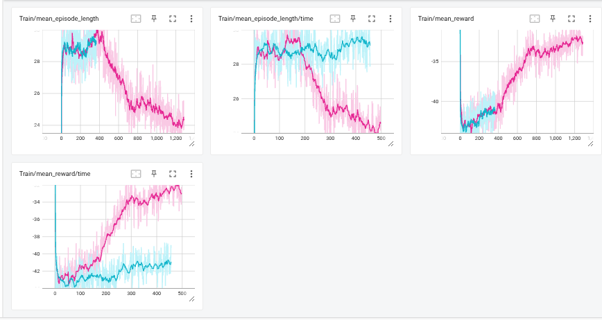
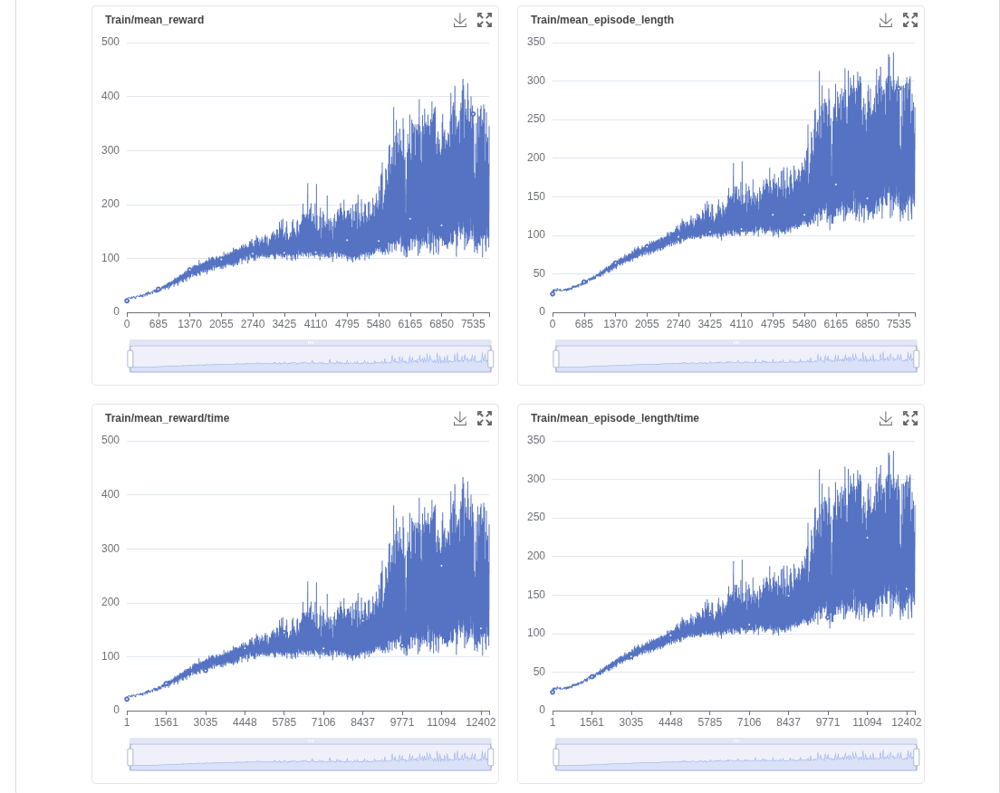

导出查看模型的方法

```
python legged_gym/scripts/play.py --task=kuavo_rough --load_run kuavo_rough --checkpoint 41650
```

`--load_run`：`log/kuavo_rough/`底下的那个目录名字

`--checkpoint`：model_后面跟着的那一串数字


这个文件的初始状态

`pointfoot_rough`参考参数


对应的结果


unitree参考参数


7.3_19.13


每episode的持续时间在减短，reward有上升

尝试从那些变化不太规律的图像对应的权重开始调

比如`ang_vel_xy:-0.1->-1`


emmm看起来效果比较一般  episodelength掉得更快了

19.44继续改大了变化不规律的图表的权重


19.57 接着改大一点`lin_vel_z`-->-0.2

也比较一般...甚至`rew_lin_vel_z`掉得更厉害了

目前看来19:44的存活时间是最长的  

而21.03这版介于中间，存活率较高，reward较低，但是要命的是我忘了用的是哪一版数据。。。


21.18


emmm这个也是episode调得特别快的(green)


回退1944开始


emmm上图是在1944的基础上把standstill从-1变成-1.5得到的。。


然后感觉训练一段时间后机器人都是曲腿掉下来的 有可能是过分地鼓励它迈步子了？稍微改小一点点


降低`stand_still`,`feet_air_time`


但是发现存活时间还不如最开始（最开始的episode高 reward没那么高

!下图和初始的比就是把`base_height_target`变成了1.0  



恩说明目标高度不好乱改，把这个改回去之后基本就没有曲腿掉下来的情况了

22.24发现它会倾倒 增大了`orientation`，减小了`stand_still`  


但是后面还是掉下去了紫色


23.04 没头绪了先随便改一下试试看


很神奇 步态也变了


23.23发现它会侧翻扭曲倒下  于是


23.41


00.04


不壕  下面那条，掉的非常快


最上面那个玫红色是23.41


7.4_1.18


**7.4**

总结了一下昨天的经验 要想让机器人活得更久，必须要让这个奖励高于快速死亡，但是若单方面地提高survival，很可能会让它走一些偏方去提高存活时间，比如曲着膝盖掉下来，而无法形成更稳定的状态，所以接下来的一段时间用控制变量法去一个一个修改一下`survival` `tracking_ang_vel` `tracking_lin_vel`几个正奖励项。


橙色那条伸得比较长的


## Survival

12.50接下来增大survival->800


出现了一个很诡异的long  并且屈腿现象非常明显

13.11->suvival=1000

蓝色这条，episode掉得更快了


 13.28->survival=1200

玫红色，居然又升回来了，但是此时学习率降低，并且统一都是屈腿掉下来的


 13.47->1500 黄色


 15.25->400紫色


并且此时的Loss也在2500左右有一些不同寻常的变化（紫色是`suvival=400`，黄色是`survival=1500` 它们都在2000-3000轮出现了明显的reward升高，episode降低，与此同时Loss也出现了明显变化


> 在强化学习（尤其是PPO算法）训练过程中，`Loss/value_function`（值函数损失）和 `Loss/surrogate`（替代损失）的突然异常变化通常表明训练出现了**策略崩溃**或**数值不稳定问题**。以下是可能的原因和解决方案：
>
> ------
>
> ### **1. 现象分析**
>
> - **`Loss/value_function` 急剧下降接近0**：
>   值函数（Critic）过度拟合当前策略的回报分布，可能因：
>   - 值函数网络学习率过高，快速收敛到一个局部最优（甚至是错误估计）。
>   - 奖励函数设计不合理（如稀疏奖励或突然的奖励突变），导致回报分布崩溃。
> - **`Loss/surrogate` 明显上升**：
>   策略（Actor）的优化方向与值函数估计严重偏离，可能因：
>   - 策略更新步长（`clip_range`）过大，导致参数突变。
>   - 优势估计（Advantage）因值函数失效而失真。


reward上升原因如图，感觉基本上是惩罚太多奖励太少了


## tracking_lin_vel

Survival调回1500

17.20 tracking_lin_vel--->250绿色


emmm从一开始rew和epi就变得很快是不是说明提早跳出策略了呢

18.24->300橙色 


唉 环境崩了一下 拉回来之前那一版感觉效果还挺神奇的 于是从这里开始看一下


起码还是上升的yyyy虽然上升了一小会也卡住了


emmm怎么网站上的还不太一样  而且当坐标拉太长的时候变化不明显的会直接变成一条线


20.26先把base_height_target变成0.8逝一下

感觉0.8还是合理一点的


但是后面还是会掉下来（epochs=1000左右放缓，2000大跌


增大base_height防止瘫倒 `baseheight=-0.04`


在epochs=1500左右开始下跌

继续增大lin_val和ang_val（此时base_height=-0.04)

```
#23.02
tracking_ang_vel = 15        #奖励跟踪目标角速度（如转向速度）。
tracking_lin_vel = 30.0     #奖励跟踪目标线速度（如前进速度）。
```


总的来说可以看出来增大这三个参数是有用的

```
#7.5  00:38
tracking_ang_vel = 30        #奖励跟踪目标角速度（如转向速度）。
tracking_lin_vel = 45.0     #奖励跟踪目标线速度（如前进速度）。
```


```
#7.5 11:10   base_height->-0.06
```


```
#13.12
 base_height = -0.08
 tracking_ang_vel = 40        #奖励跟踪目标角速度（如转向速度）。
 tracking_lin_vel = 55.0     #奖励跟踪目标线速度（如前进速度）。
```


（绿色）emmm反而更早地掉下来了  


结合以下这些图可以发现  在`episode length`和`reward`出现反常下跌的同时，很多上面的子项都是由有规律地单调下降变成急速上升，猜测尽量让异常项都逐步下降可以实现目标效果？在表现最好的紫色这一版进行分析，，

……除了base_height和lin_vel_z特别诡异之外没有发现别的特别的  不好判断因果关系

先随便改一下试试看

退回到紫色那一版`（july5 11.10）`  然后修改以下参数

```
#7.5 17.15
ang_vel_xy = -0.1 
stand_still = -1.5
```


唯一好的地方就是居然没有掉下来）但是感觉还是会停滞住很久然后开始跑偏  而且这个时候学习率已经降到很低了


7.11

***注：gradmotion中ep=20那个训练任务的超参文件就是上面那条最后的橙色线，只改过scales里面的东西，其他都没改。***

```
episode_length = 25  #原来是20
```

结果详见gradmotion的任务`ep=25`

```
episode_length = 15
```

结果详见gradmotion的任务`ep=15`

基于gradmotion的ai调参建议，修改（此时ep还是改回20了

```
feet_distance = -15.0  # 调整权重
stand_still = -2.0     # 调整权重
```

```
class algorithm:
    learning_rate = 2.e-3  # 调整学习率   原来是1.e-3
    num_learning_epochs = 10  # 增加学习周期   原来是5
```


对应gradmotion的`ai_advice`


好了 到此为止的代码保存在原文件中，接下来跳转到adjust进行一些参数加结构上的修改

```
episode_length_s = 15  #ep改回15
```

```
num_learning_epochs = 5  #额怎么本来是5又让我改成10又改回来
```

```
train_cfg.runner.learning_rate = 0.0015  #原来是0.002
```

> #### **引入学习率调度**
>
> - **策略**：使用 `torch.optim.lr_scheduler`。
> - **实现**： 在训练脚本中添加学习率调度器。
>
> ```python
> # 引入学习率调度器
> from torch.optim.lr_scheduler import StepLR
> 
> optimizer = torch.optim.Adam(ppo_runner.policy.parameters(), lr=train_cfg.runner.learning_rate)
> scheduler = StepLR(optimizer, step_size=100, gamma=0.9)  # 每100步学习率衰减为原来的90%
> 
> # 在训练循环中更新学习率
> for epoch in range(train_cfg.runner.max_iterations):
>     ppo_runner.learn_one_epoch()
>     scheduler.step()
> ```

查了一下发现这里的lr是自适应模式(看来这个ai并没有通读上传的代码，只是套路化地给出回答)，rew每次都过早地进入平台期应该和Loss/Learningrate的下降有关；针对lr的下降有两种可能，一是kl散度过高（更新过于激进导致学习率被自适应算法强行遏制），二是策略未更新（lr本身就小，缺乏探索）

```
# 若KL散度持续过高
desired_kl = 0.02  # 放宽阈值(0.01)
clip_param = 0.3    # 允许更大更新(0.2)
（同时还把初始lr降低到了1.5e-3

# 若KL散度持续为0
learning_rate = 5e-4  # 提高初始学习率
entropy_coef = 0.02   # 增加探索
```

由于不知道怎么看`approx_kl`，不知道到底是哪种情况，先来试一下第一个（考虑到前期rew其实涨得还挺明显的


对应`gradmotion`的`adjust_lr`

神奇.....

个破ai我ep是15就让我改20是20就让我改15*  考虑到难度大的任务ep需要放大一点，还是选择20

然后 既然上面的路子看起来有一点用 再调高一点试试看

```
episode_length_s = 20  # episode length in seconds  
desired_kl = 0.03
clip_param = 0.4
```

对应`adjust_lr1`


但是跟前面一次比，两千多的时候斜率明显变小了，不知道是不是ep的问题，只把ep改回15试试看

```
episode_length_s = 15
```


（上图为adjust_lr2)也还是台菜了

```
#这次把ep改成20,kl和clip改回上一版
episode_length_s = 20  # episode length in seconds  
desired_kl = 0.02
clip_param = 0.3
#对应adjust_lr3
```


NOPE.

eee把所有参数又改回`ajust_lr`，为什么还能差这么多


> ### **优化奖励函数**
>
> #### **1. 增加生存奖励的权重**
>
> - **当前权重**：1500
> - **新权重**：2000
> - **实现**： 修改 `reward_scales` 中的 `survival` 权重。
>
> ```python
> # 增加生存奖励的权重
> self.reward_scales['survival'] = 2000
> ```
>
> #### **2. 增加 `tracking_lin_vel` 和 `tracking_ang_vel` 的权重**
>
> - **当前权重**：45.0 和 30.0
> - **新权重**：50.0 和 35.0
> - **实现**： 修改 `reward_scales` 中的 `tracking_lin_vel` 和 `tracking_ang_vel` 权重。
>
> ```python
> # 增加 tracking_lin_vel 和 tracking_ang_vel 的权重
> self.reward_scales['tracking_lin_vel'] = 50.0
> self.reward_scales['tracking_ang_vel'] = 35.0
> ```

#继续更改参数如下

```
survival = 2000
tracking_ang_vel = 35        #奖励跟踪目标角速度（如转向速度）。30
tracking_lin_vel = 50.0     #奖励跟踪目标线速度（如前进速度）。 45
```

`ai_advice2`  基本也没什么大变化  和repeat那次差不多


都是开始上升得很快但是迅速进入一个平台期

可能原因:

1.

- **现象**：智能体早期通过随机探索发现一些有效策略，后期过度依赖已知策略，停止探索更优解。
- **表现**：Q值收敛过快，策略熵（entropy）急剧下降。

2.

初始学习率太大导致其太快收敛到最优解

3.

- **γ (gamma) 过大**：长期奖励主导，短期策略差异被掩盖。

```
learning_rate = 1.5e-3-->1.0e-3
gamma = 0.99-->0.95
entropy_coef = 0.01--->0.02
```

对应`explore1`  。。。。。。。。


```
learning_rate = 1.5e-3
gamma = 0.99-->0.998
entropy_coef = 0.01--->0.05
```

不行就乖乖回去调rew参数了


还是改回去好了。。。

接下来

```
learning_rate = 1.5e-3
gamma = 0.99
entropy_coef = 0.01
```

然后看上面的子项里后面明显进入一个平台的那些项  把他们的权重变大点  先是改下面几个

```
tracking_ang_vel = 35-->40
orientation = -5.0-->-10
stand_still = -2.0-->-4
ang_vel_xy = -0.1 -->-0.2
```

对应`rew1`


继续

```
orientation = -15.0
stand_still = -8.0
lin_vel_z = -0.1-->-0.2
```

对应`rew2`  bu tai xing


观察一下可以发现torque那几条曲线总是表现得比较好的那几条曲线（其他趴着的时候这几条斜率正常，其他增长的时候这几条斜率过大，推测这几个的权重相对其他是比较大的，所以可以适当继续增大其他权重或者减小这几个的权重：


继续

```
base_height = -0.06->>-0.10
ang_vel_xy = -0.2->-0.4
dof_acc = -2.5e-07 ->-3.5e-07
feet_air_time = 60->80
survival = 2000->2300
```

`rew3` 唉太喜欢这张了先放一下以防以后见不到


最后差不多是这样


可以看到`rew_torque_limits`和`rew_torque`窜得太厉害了可能遏制了其他项的增长


额对上图补一个悲惨的后续  不收敛了




```
torque_limits = -0.1-->-0.05
torques = -2.0e-06 -->-1.0e-06
tracking_ang_vel = 40-->45
survival = 2300-->2600
feet_air_time = 60-->100
```

从上一次结果来看rew_ang_vel_xy也应该继续增大点 但是这次改的已经有点多了所以再看看

`rew4`最好的一集


```
#rew5
torque_limits = -0.03        #原来是-0.05
torques = -6.0e-07      #惩罚关节扭矩过大，保护硬件仿真真实性。原来是-1.0e-6
lin_vel_z = -0.2->-0.4
ang_vel_xy = -0.4->-0.8
```


怎么回事。。。刚开始显示这样的 刷新了一下之后变成了：


rew5改完参数之后平台更低了，说明更改的这些并不利于它的长期稳定性。 但是还是觉得torque项太大对整体并没有好处，因为恰好toque开始继续增大的时候也是length开始放缓的时候（但是不得不说这个时候`terrain_level`就蹭蹭地上去了。。

还是先改回去

```
torques = -1.0e-06
torque_limits = -0.05
stand_still = -8.0-->-10
tracking_ang_vel = 50        #奖励跟踪目标角速度（如转向速度）。45
tracking_lin_vel = 55.0     #奖励跟踪目标线速度（如前进速度）。 50
feet_air_time = 100 ->120
```

`rew6`


在这里贴一个rew4的超参防止丢失

```
from legged_gym.envs.base.base_config import BaseConfig

class KUAVORoughCfg(BaseConfig):
    class env:
        num_envs = 8192
        # num_envs = 128
        # num_propriceptive_obs = 27
        num_propriceptive_obs = 45
        # num_privileged_obs = 148  # if not None a priviledge_obs_buf will be returned by step() (critic obs for assymetric training). None is returned otherwise
        num_privileged_obs = 166  # if not None a priviledge_obs_buf will be returned by step() (critic obs for assymetric training). None is returned otherwise
        num_actions = 12  # number of actions (joint angles)
        env_spacing = 3.  # not used with heightfields/trimeshes
        send_timeouts = True  # send time out information to the algorithm
        episode_length_s = 15  # episode length in seconds /20

    class terrain:
        mesh_type = 'trimesh'  # "heightfield" # none, plane, heightfield or trimesh
        horizontal_scale = 0.1  # [m]
        vertical_scale = 0.005  # [m]
        border_size = 25  # [m]
        curriculum = True
        static_friction = 0.4
        dynamic_friction = 0.6
        restitution = 0.8
        # rough terrain only:
        measure_heights_actor = False
        measure_heights_critic = True
        measured_points_x = [-0.5, -0.4, -0.3, -0.2, -0.1, 0., 0.1, 0.2, 0.3, 0.4,
                             0.5]  # 1mx1m rectangle (without center line)
        measured_points_y = [-0.5, -0.4, -0.3, -0.2, -0.1, 0., 0.1, 0.2, 0.3, 0.4, 0.5]
        selected = False  # select a unique terrain type and pass all arguments
        terrain_kwargs = None  # Dict of arguments for selected terrain
        max_init_terrain_level = 5  # starting curriculum state
        terrain_length = 8.
        terrain_width = 8.
        num_rows = 10  # number of terrain rows (levels)
        num_cols = 20  # number of terrain cols (types)
        # terrain types: [smooth slope, rough slope, stairs up, stairs down, discrete]
        terrain_proportions = [0.1, 0.1, 0.35, 0.25, 0.2]
        # trimesh only:
        slope_treshold = 0.75  # slopes above this threshold will be corrected to vertical surfaces

    class commands:
        curriculum = False
        max_curriculum = 1.
        num_commands = 4  # default: lin_vel_x, lin_vel_y, ang_vel_yaw, heading (in heading mode ang_vel_yaw is recomputed from heading error)
        resampling_time = 10.  # time before command are changed[s]
        heading_command = True  # if true: compute ang vel command from heading error

        class ranges:
            lin_vel_x = [-1.0, 1.0]  # min max [m/s]
            lin_vel_y = [-0.2, 0.2]  # min max [m/s]
            ang_vel_yaw = [-1, 1]  # min max [rad/s]
            heading = [-3.14, 3.14]

    class init_state:
        pos = [0.0, 0.0, 0.9]  # x,y,z [m]
        rot = [0.0, 0.0, 0.0, 1.0]  # x,y,z,w [quat]
        lin_vel = [0.0, 0.0, 0.0]  # x,y,z [m/s]
        ang_vel = [0.0, 0.0, 0.0]  # x,y,z [rad/s]
        default_joint_angles = {  # target angles when action = 0.0
            "leg_l1_joint": 0.0203239,
            "leg_l2_joint": 0.00101789,
            "leg_l3_joint": -0.486605,
            "leg_l4_joint": 0.898449,
            "leg_l5_joint": -0.464198,
            "leg_l6_joint": -0.0203749,
            "leg_r1_joint": -0.0184533,
            "leg_r2_joint": -0.00101041,
            "leg_r3_joint": -0.486857,
            "leg_r4_joint": 0.899395,
            "leg_r5_joint": -0.46488,
            "leg_r6_joint": 0.018477,
        }

    class control:
        # control_type = 'P'  # P: position, V: velocity, T: torques
        control_type = 'T'  # P: position, V: velocity, T: torques
        # PD Drive parameters:
        stiffness = {
            "leg_l1_joint": 0.0,
            "leg_l2_joint": 0.0,
            "leg_l3_joint": 0.0,
            "leg_l4_joint": 0.0,
            "leg_l5_joint": 0.0,
            "leg_l6_joint": 0.0,
            "leg_r1_joint": 0.0,
            "leg_r2_joint": 0.0,
            "leg_r3_joint": 0.0,
            "leg_r4_joint": 0.0,
            "leg_r5_joint": 0.0,
            "leg_r6_joint": 0.0,
        }  # [N*m/rad]
        damping = {
            "leg_l1_joint": 0.1,
            "leg_l2_joint": 0.1,
            "leg_l3_joint": 0.1,
            "leg_l4_joint": 0.1,
            "leg_l5_joint": 0.1,
            "leg_l6_joint": 0.1,
            "leg_r1_joint": 0.1,
            "leg_r2_joint": 0.1,
            "leg_r3_joint": 0.1,
            "leg_r4_joint": 0.1,
            "leg_r5_joint": 0.1,
            "leg_r6_joint": 0.1,
        }  # [N*m*s/rad]
        # action scale: target angle = actionScale * action + defaultAngle
        # action_scale = 0.5
        action_scale = 1.0
        # decimation: Number of control action updates @ sim DT per policy DT
        decimation = 4

    class asset:
        file = '{LEGGED_GYM_ROOT_DIR}/resources/robots/kuavo/urdf/biped_s45.urdf'
        name = 'biped_s45'  # name of the robot, used for the asset name in isaac gym
        # foot_name = ['ll_foot_toe', 'll_foot_heel', 
        #             'rl_foot_toe', 'rl_foot_heel']
        # foot_name = 'foot'  # name of the foot link, used to identify feet in the robot
        feet_names = ['l_foot_toe', 'l_foot_heel', 'lr_foot_toe', 'lr_foot_heel',
                      'r_foot_toe', 'r_foot_heel', 'rr_foot_toe', 'rr_foot_heel']  # names of the feet links, used to identify feet in the robot
        terminate_after_contacts_on = ["leg_l1", "leg_l2", "leg_l3", "leg_l4",
                                       "leg_r1", "leg_r2", "leg_r3", "leg_r4",
                                       "base"]
        penalize_contacts_on = ["leg_l4", "leg_r4"]
        disable_gravity = False
        collapse_fixed_joints = True  # merge bodies connected by fixed joints. Specific fixed joints can be kept by adding " <... dont_collapse="true">
        fix_base_link = False  # fixe the base of the robot
        default_dof_drive_mode = 3  # see GymDofDriveModeFlags (0 is none, 1 is pos tgt, 2 is vel tgt, 3 effort)
        self_collisions = 0  # 1 to disable, 0 to enable...bitwise filter
        replace_cylinder_with_capsule = True  # replace collision cylinders with capsules, leads to faster/more stable simulation
        flip_visual_attachments = False  # Some .obj meshes must be flipped from y-up to z-up

        density = 0.001
        angular_damping = 0.
        linear_damping = 0.
        max_angular_velocity = 1000.
        max_linear_velocity = 1000.
        armature = 0.
        thickness = 0.01

    class domain_rand:
        randomize_friction = True
        friction_range = [0.5, 1.6]
        randomize_base_mass = True
        added_mass_range = [-1., 2.]
        randomize_base_com = True
        rand_com_vec = [0.03, 0.02, 0.03]
        push_robots = True
        push_interval_s = 7
        max_push_vel_xy = 1.

    class rewards:
        class scales:
            action_rate = -0.01     #惩罚动作频率过高，鼓励平滑控制，鼓励减少电机频繁变化
            ang_vel_xy = -0.4      #惩罚身体横向旋转（如翻滚），保持姿态稳定。
            base_height = -0.10
            collision = -50.0       #严重惩罚身体碰撞（如膝盖触地）。
            dof_acc = -3.5e-07      #惩罚关节加速度突变，提升运动稳定性。
            dof_pos_limits = -0.0
            dof_vel = -0.0
            feet_air_time = 100      #奖励足端腾空时间（对应步态周期中的摆动相）。
            feet_contact_forces = -0.003    #惩罚足端接触力过大，模拟真实地面交互。
            feet_stumble = -0.0             #预留参数，惩罚足端打滑（当前未启用）。
            lin_vel_z = -0.2        #惩罚垂直方向速度（如跳跃或跌落）。
            no_fly = 1.0
            orientation = -15.0  #惩罚身体倾斜，维持直立姿态。
            stand_still = -8.0
            termination = -0.0      #任务终止惩罚（当前未启用）。...?
            torque_limits = -0.05        #原来是-0.1
            torques = -1.0e-06      #惩罚关节扭矩过大，保护硬件仿真真实性。原来是-2.0e-6
            tracking_ang_vel = 45        #奖励跟踪目标角速度（如转向速度）。30
            tracking_lin_vel = 50.0     #奖励跟踪目标线速度（如前进速度）。 45
            unbalance_feet_air_time = -100.0    #惩罚非对称步态（如三足腾空时的失衡）。
            unbalance_feet_height = -20.0
            feet_distance = -15
            survival = 2600     #长期存活奖励，鼓励避免终止条件。

#关键阈值参数
        base_height_target = 0.8        #机器人基座（躯干）的目标高度（单位：米）。
        soft_dof_pos_limit = 0.95  # percentage of urdf limits, values above this limit are penalized 关节位置软限制（URDF定义范围的95%，超限时惩罚）。
        soft_dof_vel_limit = 0.95
        soft_torque_limit = 0.95  #扭矩软限制（最大扭矩的95%）。
        max_contact_force = 1000.  # forces above this value are penalized  最大接触力阈值（单位：牛顿），超限触发惩罚。
        only_positive_rewards = False  # if true negative total rewards are clipped at zero (avoids early termination problems)
        min_feet_distance = 0.02
        min_feet_air_time = 0.1  #最小足端腾空时间（秒），避免拖地。
        max_feet_air_time = 0.85  #最大腾空时间，防止跳跃过高。
        tracking_sigma = 0.25  # tracking reward = exp(-error^2/sigma)，速度跟踪奖励的平滑系数

    class normalization:
        class obs_scales:
            lin_vel = 2.0
            ang_vel = 0.25
            dof_pos = 1.0
            dof_vel = 0.05
            height_measurements = 5.0

        clip_observations = 100.
        clip_actions = 100.

    class noise:
        add_noise = True
        noise_level = 1.0  # scales other values

        class noise_scales:
            dof_pos = 0.01
            dof_vel = 1.5
            lin_vel = 0.1
            ang_vel = 0.2
            gravity = 0.05
            height_measurements = 0.1

    # viewer camera:
    class viewer:
        ref_env = 0
        pos = [5, 5, 4]  # [m]
        lookat = [10., 10., 1.5]  # [m]

    class sim:
        dt = 0.005
        substeps = 1
        gravity = [0., 0., -9.81]  # [m/s^2]
        up_axis = 1  # 0 is y, 1 is z

        class physx:
            num_threads = 32
            solver_type = 1  # 0: pgs, 1: tgs
            num_position_iterations = 4
            num_velocity_iterations = 0
            contact_offset = 0.01  # [m]
            rest_offset = 0.0  # [m]
            bounce_threshold_velocity = 0.5  # 0.5 [m/s]
            max_depenetration_velocity = 1.0
            max_gpu_contact_pairs = 2 ** 24  # 2**24 -> needed for 8000 envs and more
            default_buffer_size_multiplier = 5
            contact_collection = 2  # 0: never, 1: last sub-step, 2: all sub-steps (default=2)


class KUAVORoughCfgPPO(BaseConfig):
    seed = 42
    runner_class_name = 'OnPolicyRunner'

    class policy:
        init_noise_std = 1.0
        # actor_hidden_dims = [512, 256, 128]
        actor_hidden_dims = [1024, 512, 256, 128]
        # critic_hidden_dims = [512, 256, 128]
        critic_hidden_dims = [1024, 512, 256, 128]
        activation = 'elu'  # can be elu, relu, selu, crelu, lrelu, tanh, sigmoid
        # only for 'ActorCriticRecurrent':
        # rnn_type = 'lstm'
        # rnn_hidden_size = 512
        # rnn_num_layers = 1

    class algorithm:
        # training params
        value_loss_coef = 1.0
        use_clipped_value_loss = True
        clip_param = 0.3  #原来是0.2
        entropy_coef = 0.01
        num_learning_epochs = 10
        num_mini_batches = 4  # mini batch size = num_envs*nsteps / nminibatches
        learning_rate = 1.5e-3  # 5.e-4
        schedule = 'adaptive'  # could be adaptive, fixed
        gamma = 0.99  #原来是0.99
        lam = 0.95
        desired_kl = 0.02  #原来是0.01
        max_grad_norm = 1.

    class runner:
        policy_class_name = 'ActorCritic'
        algorithm_class_name = 'PPO'
        num_steps_per_env = 24  # per iteration
        max_iterations = 100000  # number of policy updates

        # logging
        save_interval = 50  # check for potential saves every this many iterations
        experiment_name = 'kuavo_rough'
        run_name = ''
        # load and resume
        resume = False
        load_run = -1  # -1 = last run
        checkpoint = -1  # -1 = last saved model
        resume_path = None  # updated from load_run and chkpt

```


导入`rew1`的最后一次`.pt`文件然后开始继续训练

`continue1`参数完全复刻了原来`rew1`的参数

`continue2`:

```
feet_air_time = 100      #奖励足端腾空时间（对应步态周期中的摆动相）。
tracking_ang_vel = 45
survival = 2500 
learning_rate = 1.0e-3
```

都没什么进展，基本都是平的


`continue3`

```
tracking_ang_vel = 55        #奖励跟踪目标角速度（如转向速度）。30
tracking_lin_vel = 60.0     #奖励跟踪目标线速度（如前进速度）。 45
survival = 2700     #长期存活奖励，鼓励避免终止条件。
unbalance_feet_air_time = -100.0->-120.0    #惩罚非对称步态（如三足腾空时的失衡）。
unbalance_feet_height = -20->-25.0   不知道具体啥意思，先改了试试看
```


`continue4`

```
feet_air_time = 160
tracking_ang_vel = 55->70        #奖励跟踪目标角速度（如转向速度）。30
tracking_lin_vel = 60.0  ->80   #奖励跟踪目标线速度（如前进速度）。 45
```


`continue5`

```
base_height_target = 0.76        #机器人基座（躯干）的目标高度（单位：米）。  ....会有用吗？感觉看到baseline里面的机器人都是先微微蹲下再开始走的 是不是会稳定点？
lin_vel_z =-0.1-> -0.2
feet_distance = -15->-10   #让它把jio分开点 不要一起跳了  
```


`continue6`感觉都没什么变化？稍微激进一点点

```
torque_limits = -0.1->-0.12
torques =-2e-06 -> -2.5e-06      #惩罚关节扭矩过大，保护硬件仿真真实性。
ang_vel_xy = -0.2->-0.3      #惩罚身体横向旋转（如翻滚），保持姿态稳定。
orientation = -10->-15.0  #惩罚身体倾斜，维持直立姿态。
 tracking_ang_vel = 100.0        #奖励跟踪目标角速度（如转向速度）。30
tracking_lin_vel = 120.0     #奖励跟踪目标线速度（如前进速度）。 45
```


`continue7`

```
tracking_ang_vel = 150.0        #奖励跟踪目标角速度（如转向速度）。30
tracking_lin_vel = 170.0     #奖励跟踪目标线速度（如前进速度）。 45
```

`continue8`

```
feet_air_time = 260    #奖励足端腾空时间（对应步态周期中的摆动相）。
feet_distance = -10
```

上面几项全都是在150-200左右震荡，始终没有进一步上升的迹象

`continue9`退回`rew3`，(*救命 我忘了原来是`rew1`的但是先这样吧)

```
lin_vel_z = -0.2->-0.4        #惩罚垂直方向速度（如跳跃或跌落）。
feet_contact_forces = -0.003-->-0.006    #惩罚足端接触力过大，模拟真实地面交互。
feet_distance = -15->-30  #惩罚足端间距过小，鼓励稳定步态。？
feet_air_time = 80->120      #奖励足端腾空时间（对应步态周期中的摆动相）。
```

`continue10`退回`rew1` 同时做上述更改


`continue11` 

```
tracking_ang_vel：从 40 提高到 150。
tracking_lin_vel：从 50.0 提高到 170.0。
生存奖励：从 2300 提高到 2700。
```


`continue12`(在网站上是第二个`continue11` *打错了)

```
feet_air_time = 150      #奖励足端腾空时间（对应步态周期中的摆动相）。
tracking_ang_vel = 170        #奖励跟踪目标角速度（如转向速度）。30
tracking_lin_vel = 190.0     #奖励跟踪目标线速度（如前进速度）。 45
survival = 2900     #长期存活奖励，鼓励避免终止条件。
```


`continue13`

```
feet_distance = -100
feet_air_time = 150 
```


`continue14`

```
unbalance_feet_air_time = -10.0    #惩罚非对称步态。惩罚足端空中时间不平衡，鼓励对称的步态
unbalance_feet_height = -5.0
feet_distance = -250   #惩罚足端距离过近，计算各足间距是否小于最小值，防止足端碰撞，保持稳定支撑多边形
feet_air_time = 350
```


`continue15`

```
learning_rate = 3e-3  # 5.e-4
min_feet_distance = 0.03
survival = 3000
lin_vel_z = -0.8        #惩罚垂直方向速度，防止机器人上下跳动，保持稳定的高度。 
feet_air_time = 400      #奖励足端在空中停留适当时间，惩罚太短或太长的空中时间
```


`con_rew4_1`在rew4的基础上继续修改，惩罚非对称步态


