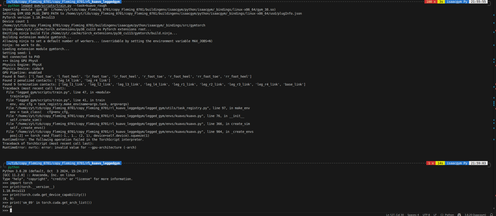
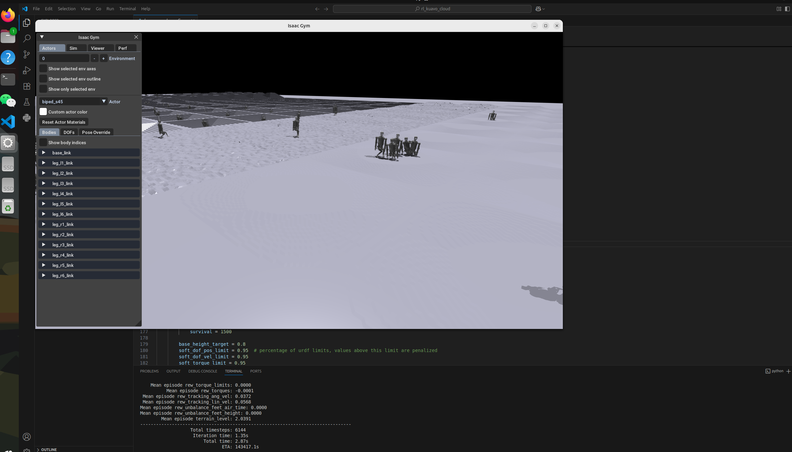

## 解决以下问题：



事实证明`Ubuntu24.04`+`RTX4070`+`nvidia-smi550`+`cuda11.8`+`pytorch2.1.0`是可以跑`leggedgym`的！

最终卸载了11.3,下载11.8并显式声明要sm89支持

### **1. 强制清理所有残留的CUDA包**

bash

```
# 彻底清除所有CUDA和NVIDIA相关包（忽略依赖错误）
sudo dpkg --purge $(dpkg -l | awk '/cuda|nvidia/ {print $2}') 2>/dev/null
sudo apt autoremove
sudo rm -rf /usr/local/cuda*  # 删除手动安装的CUDA
sudo reboot
```

------

### **2. 修复损坏的依赖关系**

bash

```
sudo apt --fix-broken install
sudo apt update
sudo apt dist-upgrade
```

------

跑了下面很多句，不知道最终是哪句起得作用

只安装核心工具包:

```
sudo apt install cuda-compiler-11-8 cuda-libraries-11-8 cuda-libraries-dev-11-8 cuda-command-line-tools-11-8
```

安装pytorch：

```
pip install torch==2.1.0 torchvision==0.16.0 torchaudio==2.1.0 --index-url https://download.pytorch.org/whl/cu118
```

python

```
import torch
print(f"PyTorch version: {torch.__version__}")
print(f"CUDA available: {torch.cuda.is_available()}")
print(f"Device name: {torch.cuda.get_device_name(0)}")
print(f"Compute capability: {torch.cuda.get_device_capability()}")
print(f"sm_89 support: {'sm_89' in torch.cuda.get_arch_list()}")  # 应返回 True
```

发现最后一行的输出还是不对


**清理旧安装**：

bash

```
# 如果之前有部分安装失败
sudo apt autoremove --purge cuda-*
sudo rm -rf /usr/local/cuda*
```

#### **验证 NVIDIA 驱动兼容性**

bash

```
nvidia-smi  # 确认驱动版本 ≥525.60.11（CUDA 11.8最低要求）
```

- 如果驱动版本不足：

  bash

```
sudo apt install nvidia-driver-550  # Ubuntu 24.04推荐版本
sudo reboot
```

#### 正确检查显卡架构的方法

#### 1. 首先确认 `nvidia-smi` 的正确路径

bash

```
which nvidia-smi  # 应该返回 /usr/bin/nvidia-smi
```

#### 2. 使用正确的命令检查架构

bash

```
nvidia-smi -q | grep "Product Architecture"  # 40系列应显示"Ada Lovelace"

# 或者更详细的信息
nvidia-smi --query-gpu=name,compute_capability --format=csv
# 示例输出：
# name, compute_capability
# NVIDIA GeForce RTX 4090, 8.9
```

#### **重装 PyTorch 并指定架构**

bash

```
pip uninstall -y torch torchvision torchaudio
# 安装时显式启用sm_89支持
TORCH_CUDA_ARCH_LIST="8.9" pip install torch==2.1.0 torchvision==0.16.0 torchaudio==2.1.0 --index-url https://download.pytorch.org/whl/cu118 --force-reinstall
```

####  **验证修复结果**

python

```
import torch
print(f"Device: {torch.cuda.get_device_name(0)}")  # 应显示40系列显卡型号
print(f"Compute Capability: {torch.cuda.get_device_capability()}")  # 必须显示(8,9)
print(f"sm_89 support: {'sm_89' in torch.cuda.get_arch_list()}")  # 现在应返回True
```

#### ✅ 方案1：强制启用 sm_89（推荐）

bash

```
# 重装PyTorch并显式启用sm_89支持
pip uninstall -y torch torchvision torchaudio
TORCH_CUDA_ARCH_LIST="8.9" pip install torch==2.1.0 torchvision==0.16.0 torchaudio==2.1.0 --index-url https://download.pytorch.org/whl/cu118 --no-cache-dir
```

#### 🔧 方案2：手动验证实际运行架构

python

```
import torch

# 创建测试张量
x = torch.randn(10000, 10000, device='cuda')
y = x @ x.t()

# 检查实际使用的内核
print(torch.cuda.get_device_properties(0).major, torch.cuda.get_device_properties(0).minor)  # 应输出 8 9
print("实际计算是否使用sm_89:", y.mean().item() > 0)  # 只要计算正确即表示硬件支持
```

总之就是下完了11.8再去跑train.py 就出现了这个.....

```
python legged_gym/scripts/train.py --task=kuavo_rough     
```


